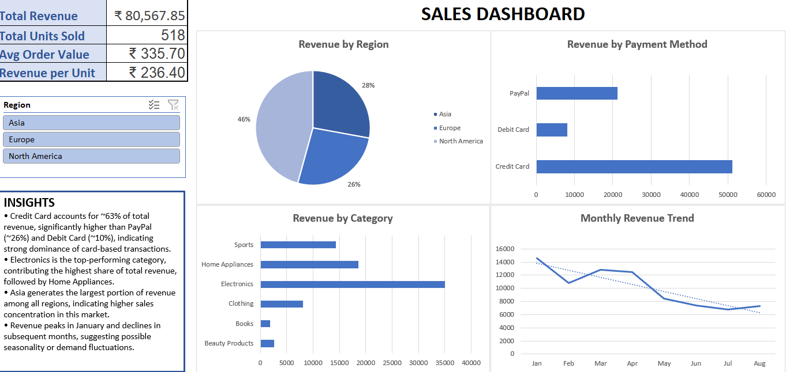

# Business Data Analysis (Excel Dashboard)

## Overview
This project demonstrates the development of an interactive Excel dashboard to analyze business sales data. It enables dynamic filtering and uncovers key insights across regions, product categories, and payment methods to support data-driven decision making.

## Objectives
- Evaluate revenue distribution across regions
- Identify top-performing product categories
- Analyze payment method preferences
- Track monthly revenue trends

## Tools Used
- Microsoft Excel
- Pivot Tables
- Pivot Charts
- Slicers
- Data Cleaning & Transformation

## Dashboard Features
- Interactive filtering using slicers
- KPI tracking (Total Revenue, Units Sold, Avg Order Value)
- Visual analysis using bar, pie, and line charts
- Dynamic updates based on user selection

## Key Insights
- Credit Card contributes ~63% of total revenue, significantly outperforming other payment methods
- Electronics is the highest revenue-generating category, indicating strong demand
- Asia contributes the highest share of revenue, indicating a strong market concentration and potential focus area for business expansion strategies.
- Revenue peaks in January and declines in subsequent months, suggesting seasonality

## Files
- Sales_Dashboard.xlsx → Complete Excel dashboard
- dashboard.png → Dashboard preview
  
## How to Use
- Open the Excel file
- Navigate to the dashboard sheet
- Use slicers to filter by region and explore insights dynamically

## Outcome
Developed an interactive business dashboard to support data-driven decision making using Excel.
